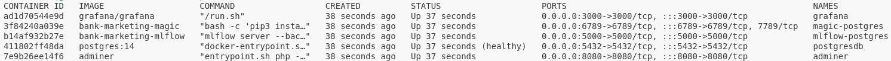
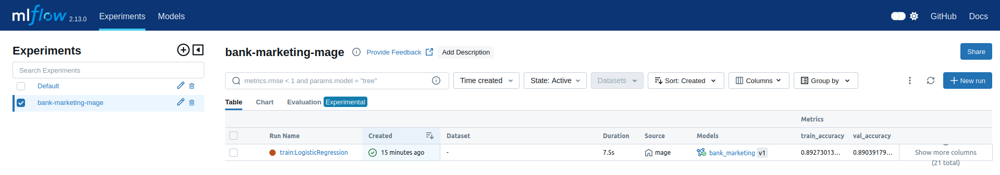
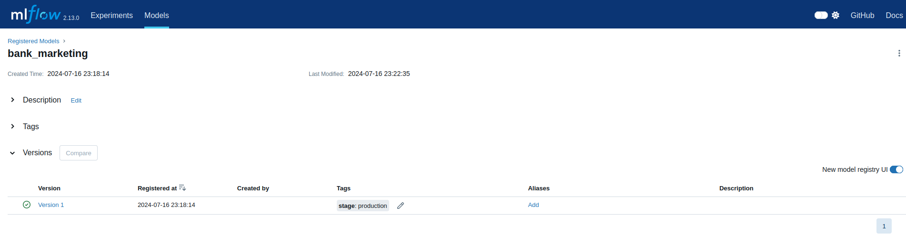
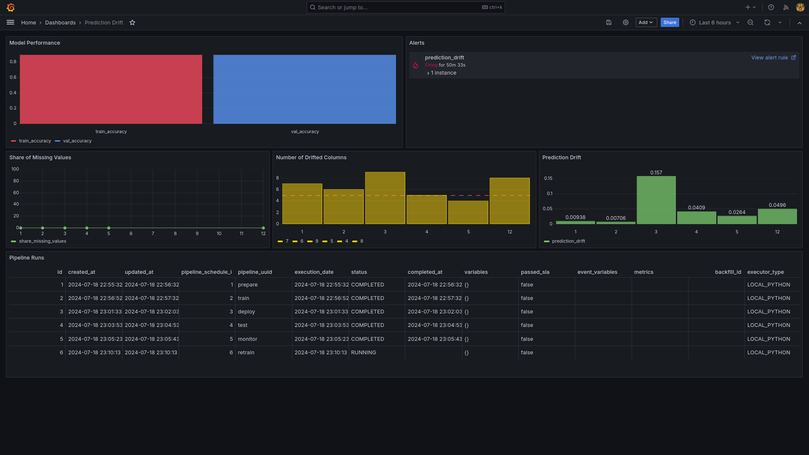
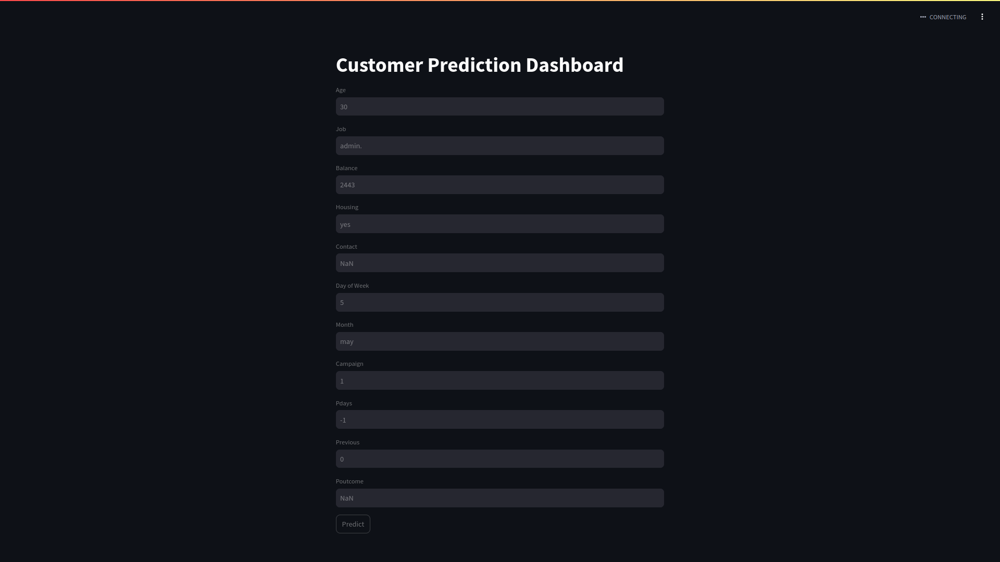

## Bank Marketing 

- [Problem description](#Problem-description) 
- [Experiment tracking and model registry](#Experiment-tracking-and-model-registry)
- [Workflow orchestration](#Workflow-orchestration)
- [Model deployment](#Model-deployment)
- [Model monitoring](#Model-monitoring)
- [Cloud](#Cloud)
- [Reproducibility](#Reproducibility)

### Problem description

In 2012 a Portuguese banking institution collected data for several direct marketing campaigns it conducted in order to analyze it and to build machine learning models that can increase the efficiency of future marketing campaigns.

A marketing campaign is a concentrated effort by the bank in which it contacts its customers by phone and asks them to subscribe to a term deposit. Term deposits, aka certificate depoists, are deposits by customers that are made for a specific period of time and tradionally return more interest than savings accounts. They provide a guarantee for the banks that the money will remain available for a known period of time, which helps them better manage their available capitol.

In this project, I'll be using the this dataset to create an end-to-end MLOps dashboard to train, deploy, and monitor an ML model that predicts whether a customer subscribes to a term deposit. The data set can be downloaded [here](https://archive.ics.uci.edu/dataset/222/bank+marketing).

The original dataset has 16 features, and one target variable: 

| Variable Name | Role     | Type        | Description | Missing Values |
|---------------|----------|-------------|-------------|----------------|
| age           | feature  | integer     | age         | no             |
| job           | feature  | categorical | occupation  | no             |
| marital       | feature  | categorical | marital status | no             |
| education     | feature  | categorical | education level            | no             |
| default       | feature  | binary      | has credit in default? | no |
| balance       | feature  | integer     | average yearly balance | no |
| housing       | feature  | binary      | has housing loan? | no |
| loan          | feature  | binary      | has personal loan? | no |
| contact       | feature  | categorical | contact communication type ('cellular','telephone') | yes |
| day_of_week   | feature  | date        | last contact day of the week | no |
| month         | feature  | date        | last contact month of year ('jan', 'feb', 'mar', ...) | no |
| duration      | feature  | integer     | last contact duration, in seconds | no |
| campaign      | feature  | integer     | number of contacts performed during this campaign and for this client (includes last contact) | no |
| pdays         | feature  | integer     | number of days that passed by after the client was last contacted from a previous campaign (-1 means client was not previously contacted) | yes |
| previous      | feature  | integer     | number of contacts performed before this campaign and for this client | no |
| poutcome      | feature  | categorical | outcome of the previous marketing campaign ('failure','nonexistent','success') | yes |
| y             | target   | binary      | has the client subscribed a term deposit? | |:

I'm discarding the following 5 features: marital, education, default, loan, duration. For more details on how the features relate to the target, check out the EDA notebook [here](./EDA.ipynb).


Tech stack:  

1. MLflow for experiment tracking and resgistration  
2. Mage for orchestration  
3. Evidently + Grafana for monitoring  
4. Docker + Flask API + Streamlit for deployment  
5. Docker-compose for running multi-container applications  
6. Postgres database to store tracking, orchestration, and monitoring data

In the worfklow, I train multiple binary classifiers, deploy the best performing one, and monitor its performance. 

Below are the details.

### Experiment tracking and model registry

MLflow is used to: 

1. Track the model's name, hyperparameter valuess, accuracy score, model object  
2. Add the trained models to the MLflow model registry  
3. Transition the top 3 models to the staging phase  
4. Transition the top 1 model to production and save it as an artifact*.  

❕ PS: I'm also saving the preprocessing code as a binary file with pickle, but I'm not using MLflow for this because I only need to save it once. 

### Workflow orchestration

In Mage, the following pipelines are created:

**Prepare**  

- Ingests the data
- Splits the data into training and validation sets
- Prepares the data by selecting the relevant columns, type casting,and imputing missing values
- Transforms it using a dict vectorizor

**Train**  
- Initiates parallel training cycles for different models (RandomForrest, XGBClassifier, LogisticRegression, SVC, MLPClassifier)
- Logs the relevant details using MLflow
- Registers the trained models in MLflow's model registry

**Deploy**  
- Transitions the top 3 models to the staging phase
- Transitions the top 1 model to the production phase
- Creates a Flask API python script 
- Creates a Dockerfile with the python script and gunicorn that can be deployed on the cloud
- Runs the the Flask API
- Runs a streamlit interface with the API that can be used to test the model

**Test**

- Loads the test data using the same ingest-prepare-build blocks from the Prepare pipeline 
- Transforms the loaded data
- Loads the production model 
- Makes predictions and prints+saves the accuracy metric

**Monitoring**

- Creates table `grafana.evidently_metrics` 
- Loads the reference data (the validation data set) and the new test data
- Creates a report that shows prediction drift, data drift, and missing values

**Retrain**

- Triggers a retraining cycle if alerted

### Model deployment

The "Deploy" pipeline creates 2 payloads:  

- [predict.py](./mlops/payloads/predict.py) script: The production model is wrapped in a Flask API 
- [predict.dockerfile](./mlops/payloads/predict.dockerfile): The predict script containerized in a docker container

To build the docker container run this command

```bash
docker build -t predict:v01 -f ./mlops/payloads/predict.dockerfile .
```

### Model monitoring

- The Grafana dashboard monitors the following metrics:
    - Model performance: Bar chart showing train and validation accuracy (source: MLflow)
    - Share of Missing Values: Trend showing share of missing values per month (source: Evidently)
    - Number of Drifted Columns: Bar chart showing the number of drifted columsn per month, and a dotted-line shows the currently accepted threshold (source: Evidently) 
    - Prediction Drift: Bar Chart showing the prediction drift value per month (source: Evidently)
    - Pipeline Runs: Table showing information on pipeline runs (source: Mage)
    - Alerts: List showing the defined alerts and their status (source: Grafana)
- Currently, prediction drift is the only defined alert. The alert fires if a prediction drift higher than 0.1 is detected in any of the months. 
    - When the alert is fired it sends a webhook notification to Mage on port 6790
    - In the Retrain pipeline a listener listens to port 6790
    - If the listener receives a POST request it creates an alert log file *and triggers a train pipeline to retrain the models*


### Cloud

⚠️ Currently, the project is setup to be deployed locally (...)

### Reproducibility

#### Prerequisite

To install the prerequisites you can follow the instructions [here](./docs/setup.md) 

#### Deployment

Next, clone this rep and move into the project directory

```bash
git clone https://github.com/el-grudge/bank-marketing.git && cd bank-marketing
```

Once inside, run this command to start the services (Postgres, adminer, Grafana, Mage, MLflow):

```bash
docker-compose up
```

❕To capture back the prompt use the `--d` option when running the above command.

To validate that the services are up and running running this command

```bash
docker ps
```

You should see an output like this



Now, go to [Mage](http://localhost:6789) and navigate to the pipeline page where you will see the 6 deployed pipelines


Run the pipelines in the following order:

1. Prepare: Will ingest and prepare the data  
2. Train: Will train multiple classifiers, track the training data, the models, their hyperparameters, and metrics, and add them to the model registry  
3. Deploy: Will transition the top 3 models to the staging stage, then move the top model to the production phase. Will also create the Flask API and inference endpoint using the production model, and the docker container that hosts the Flask API  
4. Test: Will load and prepare the test data, load the production model, and use it for inference on the test data  
5. Monitor: Will compare the validation data (reference) with the test data (current) and look for prediction drift, column drift, and number of missing values. Will create a table and store this information in it  
6. Retrain: Will trigger a new training run  

To view the logged models and the model registry go to [MLflow](http://localhost:5000).

Tracking


Model registry


To view the monitoring dashboard go to [Grafana](http://localhost:3000).



❗Grafana's initial credentials are admin/admin.

To interact with the model through streamlit dashboard go to [Streamlit app](http://localhost:8501)



## TODO List

- [x] problem description
- [x] experiment tracking
- [x] experiment registry - local
- [x] workflow orchestration - local
- [x] persist changes on mlflow
- [x] save artifacts
- [x] pip install requirements in mage container
- [x] promote top model to production
- [x] deployment - model container
- [x] add eda notebook from mleng week 7 to this docker
- [x] delete `import pandas as pd` from utils/data_preparation/prepare_data.py
- [x] move the split_train_test step from ingest block to prepare block
- [x] add evidently to mage requirements.txt
- [x] use mlflow to track training / validation datasets
- [x] split data by season  
- [x] remove line from train pipeline - train (transform) block - that selects 100 rows from data
- [x] model monitoring in grafana
- [x] build model monitoring dashboard in grafana
- [x] trigger retraining if performance decrease (test with data from different season)
- [x] modify ingest to read data from personal github repo instead of uci url, to get data for specific season
- [x] documentation
- [ ] documentation with cloud
- [ ] unit tests
- [ ] integration test
- [ ] linting / formatting
- [ ] makefile
- [ ] pre-commit hooks
- [ ] ci/cd
- [ ] mlflow experiment registry - cloud
- [ ] workflow orchestration - cloud (check volumes in docker_compose.yaml, don't upload ssh keys to cloud)
- [ ] iac 
- [ ] hyperparameter tuning with hyperops
- [x] copy only necessary files to mage docker container (./:/home/src copies everything)
- [x] add grafana to docker-compose
- [x] create shared volumnes for all docker services (volumes) (doesn't work)
- [x] connect mlflow, mage, grafana to postgres service (mage is almost impossible to do)
- [x] connect grafana to db 
- [x] add model docker to docker-compose (might need to undo this step. if model is redeployed will have to restart docker compose)
- [x] save validation dataset
- [ ] trouble shoot no database root error in postgres docker (delete all other dockers, re-add one-by-one see which one causes error)
- [x] rename transformer load to promote
- [x] clean data folders - make sure there is always 1 file only in data/test called dataset_1.csv
- [x] figure out how to reference saved prediction so that you can link it to best model
- [ ] incorporate new data when retraining
- [x] save training data along with validation data
- [ ] in test runs compare size of new data with training data
- [x] build retrainig model
- [ ] create command center dashboard with streamlit
- [ ] save preprocessor as artifact with log_artifact
- [x] save training data features as artifact with log_artifact
- [x] save validation data features as artifact with log_artifact
- [ ] grafana - show # of prediction drift months in alert
- [ ] save grafana dashboard 
- [ ] cleanup files in monitor folder
- [ ] try apply_provisioning.sh with the right permissions
- [x] try persisting email and webhook contacts and policies
- [ ] break monitoring pipeline into multiple steps with sql blco
- [ ] when monitoring figure out how to retrieve last training data to use as reference
- [ ] deploy model as lambda service
- [x] remove "drop table" from monitoring create table sql
- [x] insert into evidently table with tiemstamp column
- [ ] add validation data into training prod model - modify deploy pipeline accordingly
- [ ] evidently presets, test_suite, test_suite presets
- [ ] troubleshoot data drift - why so many columns
- [ ] alternative trigerring with evidently 
- [ ] future - replace mage with prefect
- [x] fix notification policy perisistence - it reverts back to 5 minute firing

## Evaluation Criteria

* Problem description
    * 0 points: The problem is not described
    * 1 point: The problem is described but shortly or not clearly
    * [2] points: The problem is well described and it's clear what the problem the project solves
* Cloud
    * [0] points: Cloud is not used, things run only locally
    * 2 points: The project is developed on the cloud OR uses localstack (or similar tool) OR the project is deployed to Kubernetes or similar container management platforms
    * 4 points: The project is developed on the cloud and IaC tools are used for provisioning the infrastructure
* Experiment tracking and model registry
    * 0 points: No experiment tracking or model registry
    * 2 points: Experiments are tracked or models are registered in the registry
    * [4] points: Both experiment tracking and model registry are used
* Workflow orchestration
    * 0 points: No workflow orchestration
    * 2 points: Basic workflow orchestration
    * [4] points: Fully deployed workflow 
* Model deployment
    * 0 points: Model is not deployed
    * 2 points: Model is deployed but only locally
    * [4] points: The model deployment code is containerized and could be deployed to cloud or special tools for model deployment are used
* Model monitoring
    * 0 points: No model monitoring
    * 2 points: Basic model monitoring that calculates and reports metrics
    * [4] points: Comprehensive model monitoring that sends alerts or runs a conditional workflow (e.g. retraining, generating debugging dashboard, switching to a different model) if the defined metrics threshold is violated
* Reproducibility
    * 0 points: No instructions on how to run the code at all, the data is missing
    * 2 points: Some instructions are there, but they are not complete OR instructions are clear and complete, the code works, but the data is missing
    * [4] points: Instructions are clear, it's easy to run the code, and it works. The versions for all the dependencies are specified.
* Best practices
    * [ ] There are unit tests (1 point)
    * [ ] There is an integration test (1 point)
    * [ ] Linter and/or code formatter are used (1 point)
    * [ ] There's a Makefile (1 point)
    * [ ] There are pre-commit hooks (1 point)
    * [ ] There's a CI/CD pipeline (2 points)
